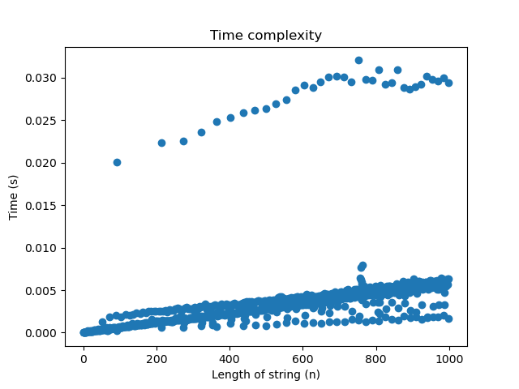
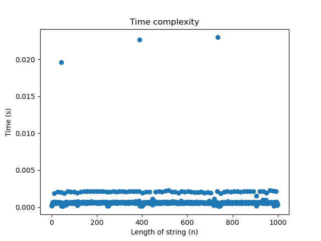

# Project 2: Suffix tree construction

You should implement a suffix tree construction algorithm. You can choose to implement the naive O(n²)-time construction algorithm as discussed in class or McCreight’s O(n) construction algorithm. After that, implement a search algorithm (similar to slow-scan) for finding all occurrences of a pattern. This algorithm should run in O(m+z) where m is the length of the pattern and z the number of occurrences.

Write a program, `st` using the suffix tree exact pattern search algorithm (similar to slow-scan) to report all indices in a string where a given pattern occurs. 

The program should take the same options as in project 1: `st genome.fa reads.fq`. The program should output (almost) the same SAM file. Because a search in a suffix tree is not done from the start to the end of the string the output might be in a different order, but if you sort the output from the previous project and for this program, they should be identical.

## Evaluation

Implement the tool `st` that does exact pattern matching using a suffix tree. Test it to the best of your abilities, and then fill out the report below.

# Report

## Specify if you have used a linear time or quadratic time algorithm.

I have implemented McCreight's O(n) algorithm.

## Insights you may have had while implementing and comparing the algorithms.

There is a lot to keep track of with the various nodes and suffix links. 

## Problems encountered if any.

I used a lot of time to understand the algorithm. 
After, it was difficult to implement in python because some things in C are so different.

## Correctness

I used all the fasta and fastq files from the previous project and tested wheter the output was as supposed.

## Running time

I simulated dna sequences with lengths ranging from 0 to 1000 bases. Then I recorded the time it took to build a suffix tree for each (see time.py). The sequence length was then plotted against the time recorded (see figure below).

The running time seems linear, however, there is some noise that seems random. To solve it, I put a delay between each sequence and it didn't solve the problem. I tested 1000 times with the same sequence and the same pattern was seen again (see the figure below). Therefore, it must be something with my computer. I don't know.

